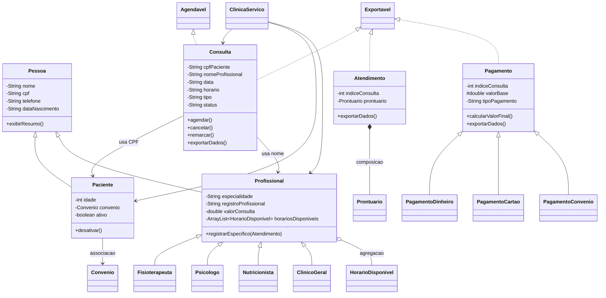

# VidaPlena - Sistema de Gestao de Clinica Multidisciplinar

Projeto academico da disciplina de Programacao Orientada a Objetos em Java.

O sistema simula a gestao de uma clinica multidisciplinar, com cadastro de pacientes e profissionais, agendamento, remarcacao, cancelamento, atendimento com prontuario, pagamentos, relatorios e exportacao de dados operacionais.

## Tecnologias

- Java
- Execucao via terminal
- Entrada de dados com `Scanner`
- Saida de dados com `System.out`
- Sem frameworks, banco de dados, bibliotecas externas ou interface grafica

## Como compilar

No terminal, entre na pasta do projeto:

```powershell
cd C:\Users\rejan\OneDrive\Desktop\POO2\ProjetoPOO-Etapa02
```

Compile os arquivos Java:

```powershell
javac src\*.java
```

## Como executar

Depois de compilar, execute:

```powershell
java -cp src Main
```

O sistema exibira o menu principal:

```text
1 - Pacientes
2 - Profissionais
3 - Consultas
4 - Atendimentos
5 - Pagamentos
6 - Relatorios
0 - Sair
```

## Operacoes principais

### Pacientes

- Cadastrar paciente minimo
- Cadastrar paciente completo
- Desativar paciente
- Buscar paciente por CPF
- Listar pacientes cadastrados
- Controlar CPF duplicado com `HashSet`
- Buscar rapidamente por CPF com `HashMap`

### Profissionais

- Cadastrar fisioterapeuta
- Cadastrar psicologo
- Cadastrar nutricionista
- Cadastrar clinico geral
- Buscar profissional por nome
- Listar profissionais cadastrados
- Registrar dias de atendimento por profissional

### Consultas

- Agendar consulta
- Cancelar consulta
- Remarcar consulta
- Listar consultas
- Bloquear conflito de horario
- Bloquear agendamento para paciente inativo

### Atendimentos

- Registrar atendimento de consulta agendada ou remarcada
- Criar prontuario automaticamente dentro do atendimento
- Registrar diagnostico, observacoes e procedimentos
- Adicionar informacoes especificas conforme a especialidade do profissional

### Pagamentos

- Pagamento em dinheiro ou pix, com desconto
- Pagamento em cartao, com limite de parcelas
- Pagamento por convenio, com validacao de cobertura
- Tratamento de pagamento invalido por excecao personalizada

### Relatorios

- Relatorio geral de consultas
- Resumo financeiro
- Relatorio unificado de pessoas
- Relatorio de pagamentos
- Exportacao de dados operacionais

## Mapa dos conceitos de POO

| Conceito | Onde aparece |
|---|---|
| Encapsulamento | Atributos privados em `Pessoa`, `Paciente`, `Profissional`, `Consulta`, `Atendimento`, `Pagamento`, `Convenio`, `HorarioDisponivel` e `Prontuario` |
| Getters e setters | Classes de entidade, como `Pessoa`, `Paciente`, `Profissional`, `Consulta`, `Pagamento` e `Convenio` |
| Setters com validacao | `Pessoa.setCpf`, `Pessoa.setNome`, `Paciente.setIdade`, `Profissional.setValorConsulta`, `Convenio.setPercentualCobertura` |
| Heranca | `Pessoa -> Paciente`, `Pessoa -> Profissional`, `Profissional -> Fisioterapeuta/Psicologo/Nutricionista/ClinicoGeral` |
| Heranca com 3 niveis | `Pessoa -> Profissional -> Fisioterapeuta`, e tambem as demais especializacoes |
| Classes abstratas | `Pessoa`, `Profissional`, `Pagamento` |
| Interfaces | `Agendavel`, `Exportavel` |
| Classe com 2 interfaces | `Consulta implements Agendavel, Exportavel` |
| Sobrescrita | `exibirResumo()` nas subclasses e `calcularValorFinal()` nos pagamentos |
| Sobrecarga | Construtores sobrecarregados em pacientes, consultas, atendimentos, profissionais e pagamentos |
| Polimorfismo | Listas de `Pessoa` e `Pagamento` tratam objetos de subclasses |
| Ligacao dinamica | Chamadas de `exibirResumo()` e `calcularValorFinal()` em referencias de tipo mais generico |
| Dynamic casting | Uso de `instanceof` no relatorio unificado de pessoas |
| Associacao | `Paciente` possui referencia para `Convenio` |
| Agregacao | `Profissional` possui lista de `HorarioDisponivel` |
| Composicao | `Atendimento` cria e contem `Prontuario` |
| Excecoes personalizadas | `PacienteInativoException`, `PacienteNaoEncontradoException`, `ProfissionalNaoEncontradoException`, `HorarioIndisponivelException`, `ConsultaNaoEncontradaException`, `OperacaoInvalidaException`, `PagamentoInvalidoException`, `ConvenioNaoCobreException` |
| Try/catch/finally | Leitura de numeros e operacoes de agendamento, atendimento e pagamento no `Main` |
| Throws especificos | Metodos de `ClinicaServico` declaram excecoes de negocio especificas |
| List | `ArrayList` para pacientes, profissionais, consultas, atendimentos, pagamentos e pessoas |
| Set | `HashSet` para controle de CPFs cadastrados |
| Map | `HashMap` para busca por CPF e por nome |

## Diagrama de classes



## Observacoes de uso

Os dados sao mantidos apenas em memoria durante a execucao. Ao encerrar o programa, os cadastros realizados no terminal nao sao salvos em arquivo ou banco de dados.

O objetivo do projeto e demonstrar os conceitos de Programacao Orientada a Objetos solicitados na etapa AV2, mantendo a execucao simples via terminal.
