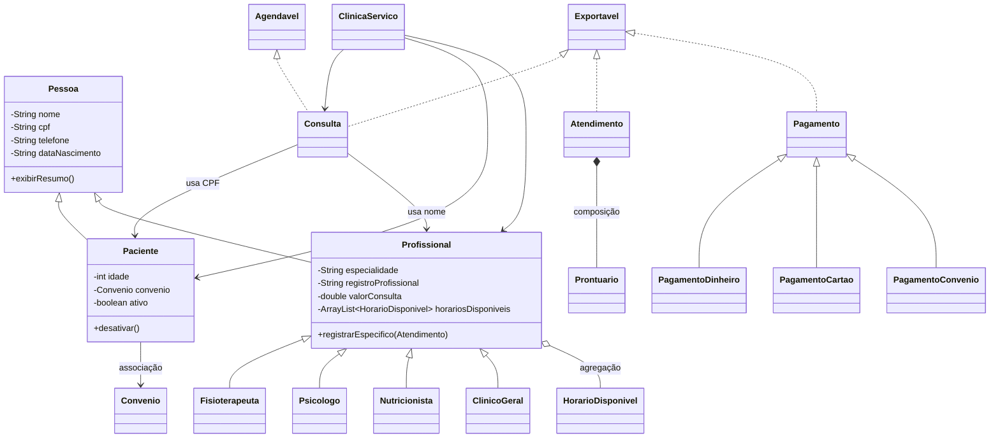

```mermaid
classDiagram
    class Pessoa {
        -String nome
        -String cpf
        -String telefone
        -String dataNascimento
        +exibirResumo()
    }

    class Paciente {
        -int idade
        -Convenio convenio
        -boolean ativo
        +desativar()
    }

    class Profissional {
        -String especialidade
        -String registroProfissional
        -double valorConsulta
        -ArrayList~HorarioDisponivel~ horariosDisponiveis
        +registrarEspecifico(Atendimento)
    }

    class Fisioterapeuta
    class Psicologo
    class Nutricionista
    class ClinicoGeral

    class Consulta
    class Atendimento
    class Prontuario
    class Pagamento
    class PagamentoDinheiro
    class PagamentoCartao
    class PagamentoConvenio
    class Convenio
    class HorarioDisponivel
    class Agendavel
    class Exportavel
    class ClinicaServico

    Pessoa <|-- Paciente
    Pessoa <|-- Profissional
    Profissional <|-- Fisioterapeuta
    Profissional <|-- Psicologo
    Profissional <|-- Nutricionista
    Profissional <|-- ClinicoGeral

    Pagamento <|-- PagamentoDinheiro
    Pagamento <|-- PagamentoCartao
    Pagamento <|-- PagamentoConvenio

    Agendavel <|.. Consulta
    Exportavel <|.. Consulta
    Exportavel <|.. Atendimento
    Exportavel <|.. Pagamento

    Paciente --> Convenio : associação
    Profissional o-- HorarioDisponivel : agregação
    Atendimento *-- Prontuario : composição

    Consulta --> Paciente : usa CPF
    Consulta --> Profissional : usa nome
    ClinicaServico --> Consulta
    ClinicaServico --> Paciente
    ClinicaServico --> Profissional
```